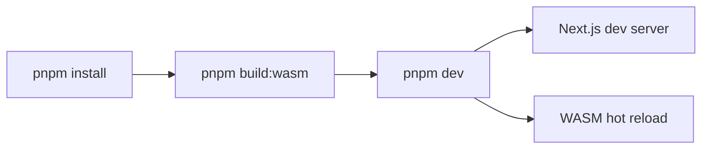
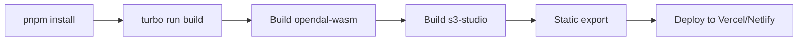

# S3 Studio Monorepo Structure

## Overview

S3 Studio is organized as a monorepo using **pnpm workspaces** and **Turborepo** for efficient builds and development.

## Directory Structure

```
s3-studio/
├── apps/
│   └── s3-studio/                  # Main web application
│       ├── app/                    # Next.js App Router
│       │   ├── layout.tsx          # Root layout
│       │   ├── page.tsx            # Home page
│       │   └── globals.css         # Global styles
│       ├── components/             # React components
│       ├── lib/                    # Utilities and helpers
│       ├── public/                 # Static assets
│       ├── package.json            # App dependencies
│       ├── next.config.ts          # Next.js config
│       ├── tsconfig.json           # TypeScript config
│       └── tailwind.config.ts      # Tailwind config
│
├── packages/
│   └── opendal-wasm/               # WASM bindings package
│       ├── src/
│       │   └── lib.rs              # Rust source code
│       ├── pkg/                    # Generated WASM output (gitignored)
│       │   ├── opendal_wasm.js     # JS bindings
│       │   ├── opendal_wasm.d.ts   # TypeScript types
│       │   └── opendal_wasm_bg.wasm # WASM binary
│       ├── Cargo.toml              # Rust dependencies
│       ├── package.json            # NPM package config
│       └── README.md               # Package documentation
│
├── docs/                           # Project documentation
│   ├── s3-studio-general-research/ # Research documents
│   └── *.md                        # Additional docs
│
├── ai-docs/                        # AI-generated documentation
│   └── opendal-s3-studio.md        # Feasibility report
│
├── pnpm-workspace.yaml             # Workspace configuration
├── turbo.json                      # Turborepo configuration
├── package.json                    # Root package.json
├── .gitignore                      # Git ignore rules
├── README.md                       # Project README
└── SETUP.md                        # Setup guide
```

## Package Details

### `apps/s3-studio`

**Name**: `@s3-studio/web`
**Type**: Next.js 16 application
**Purpose**: Main user-facing web application

**Key Dependencies**:
- `next@16.0.0` - React framework
- `react@19.2.0` - UI library
- `@s3-studio/opendal-wasm` (workspace) - WASM bindings
- `shadcn/ui` components - UI component library
- `zustand` - State management
- `tailwindcss@4` - Styling

**Scripts**:
```json
{
  "dev": "next dev",
  "build": "next build",
  "start": "next start",
  "lint": "eslint"
}
```

### `packages/opendal-wasm`

**Name**: `@s3-studio/opendal-wasm`
**Type**: Rust library compiled to WASM
**Purpose**: WebAssembly bindings for Apache OpenDAL

**Key Dependencies**:
- `opendal@0.50` - Multi-cloud storage library
- `wasm-bindgen@0.2` - Rust-WASM bridge
- `serde` - Serialization
- `serde-wasm-bindgen` - JSON serialization for WASM

**Scripts**:
```json
{
  "build": "wasm-pack build --target web --out-dir pkg --release",
  "build:dev": "wasm-pack build --target web --out-dir pkg --dev",
  "test": "wasm-pack test --headless --chrome"
}
```

**Optimization Settings** (Cargo.toml):
```toml
[profile.release]
opt-level = "z"      # Optimize for size
lto = true           # Link-time optimization
strip = true         # Strip debug symbols
codegen-units = 1    # Better optimization

[package.metadata.wasm-pack.profile.release]
wasm-opt = ["-Oz", "--enable-mutable-globals"]
```

## Workspace Configuration

### pnpm-workspace.yaml

```yaml
packages:
  - 'apps/*'
  - 'packages/*'
```

This tells pnpm to treat `apps/*` and `packages/*` as workspace packages.

### turbo.json

```json
{
  "tasks": {
    "build": {
      "dependsOn": ["^build"],
      "outputs": [".next/**", "!.next/cache/**", "pkg/**"]
    },
    "dev": {
      "cache": false,
      "persistent": true
    },
    "lint": {
      "dependsOn": ["^build"]
    },
    "build:wasm": {
      "outputs": ["pkg/**"]
    }
  }
}
```

**Key Points**:
- `"dependsOn": ["^build"]` - Build dependencies first
- `"cache": false` for dev - Always run fresh
- `"outputs"` - Cache these directories for faster rebuilds

## Build Pipeline

### Development Flow



### Production Build Flow



## Dependency Management

### Workspace Dependencies

The web app references the WASM package using `workspace:*`:

```json
{
  "dependencies": {
    "@s3-studio/opendal-wasm": "workspace:*"
  }
}
```

This ensures the local package is always used during development.

### Installing Dependencies

**Root level** (affects all workspaces):
```bash
pnpm add -D <package> -w
```

**Specific package**:
```bash
pnpm add <package> --filter @s3-studio/web
```

**WASM package** (Rust dependencies):
```bash
cd packages/opendal-wasm
cargo add <crate>
```

## Build Outputs

### WASM Package Output

Location: `packages/opendal-wasm/pkg/`

Files:
- `opendal_wasm.js` - JavaScript bindings
- `opendal_wasm.d.ts` - TypeScript definitions
- `opendal_wasm_bg.wasm` - WASM binary (~150-250KB compressed)
- `package.json` - NPM package metadata

### Next.js Build Output

Location: `apps/s3-studio/.next/`

For static export:
Location: `apps/s3-studio/out/`

## Turborepo Benefits

1. **Incremental Builds**: Only rebuild changed packages
2. **Parallel Execution**: Run tasks across packages simultaneously
3. **Remote Caching**: Share build artifacts across team (optional)
4. **Task Pipelines**: Automatic dependency resolution

## Common Tasks

### Add a new workspace package

```bash
mkdir packages/new-package
cd packages/new-package
pnpm init
```

Update `pnpm-workspace.yaml` if needed (already includes `packages/*`).

### Add a dependency to the web app

```bash
pnpm add <package> --filter @s3-studio/web
```

### Update all dependencies

```bash
pnpm update -r
```

### Clean all build artifacts

```bash
pnpm clean
```

This runs:
- `turbo run clean` (cleans package-specific artifacts)
- `rm -rf node_modules` (removes all dependencies)

## Import Paths

### In Next.js app (TypeScript)

```typescript
import init, { S3Client } from '@s3-studio/opendal-wasm';
```

### In Rust (WASM package)

```rust
use opendal::{Operator, services};
use wasm_bindgen::prelude::*;
```

## Type Safety

### WASM → TypeScript

wasm-bindgen automatically generates TypeScript definitions:

```rust
// Rust
#[wasm_bindgen]
pub struct S3Client {
    operator: Operator,
}
```

Generates:

```typescript
// TypeScript (auto-generated)
export class S3Client {
  free(): void;
  constructor(
    access_key_id: string,
    secret_access_key: string,
    region: string,
    bucket: string,
    endpoint?: string
  );
  list(path: string): Promise<any>;
}
```

## CI/CD Integration

### GitHub Actions Example

```yaml
name: Build

on: [push, pull_request]

jobs:
  build:
    runs-on: ubuntu-latest
    steps:
      - uses: actions/checkout@v4
      - uses: pnpm/action-setup@v2
        with:
          version: 9
      - uses: actions/setup-node@v4
        with:
          node-version: 20
          cache: 'pnpm'
      - uses: actions-rs/toolchain@v1
        with:
          toolchain: stable
          target: wasm32-unknown-unknown
      - uses: jetli/wasm-pack-action@v0.4.0

      - run: pnpm install
      - run: pnpm build:wasm
      - run: pnpm build
      - run: pnpm lint
```

## Benefits of This Structure

1. **Separation of Concerns**: WASM logic separate from UI
2. **Type Safety**: End-to-end types from Rust to TypeScript
3. **Reusability**: WASM package can be published to NPM
4. **Fast Builds**: Turborepo caching and parallel execution
5. **Scalability**: Easy to add more packages/apps
6. **Developer Experience**: Single `pnpm dev` command

## Future Structure

As the project grows, consider:

```
s3-studio/
├── apps/
│   ├── s3-studio/          # Main app
│   └── docs/               # Documentation site
├── packages/
│   ├── opendal-wasm/       # WASM bindings
│   ├── ui/                 # Shared UI components
│   ├── utils/              # Shared utilities
│   └── types/              # Shared TypeScript types
└── tooling/
    ├── eslint-config/      # Shared ESLint config
    └── tsconfig/           # Shared TS config
```

## Resources

- [pnpm Workspaces](https://pnpm.io/workspaces)
- [Turborepo Docs](https://turbo.build/repo/docs)
- [wasm-pack](https://rustwasm.github.io/wasm-pack/)
- [Next.js Monorepo](https://nextjs.org/docs/advanced-features/multi-zones)
